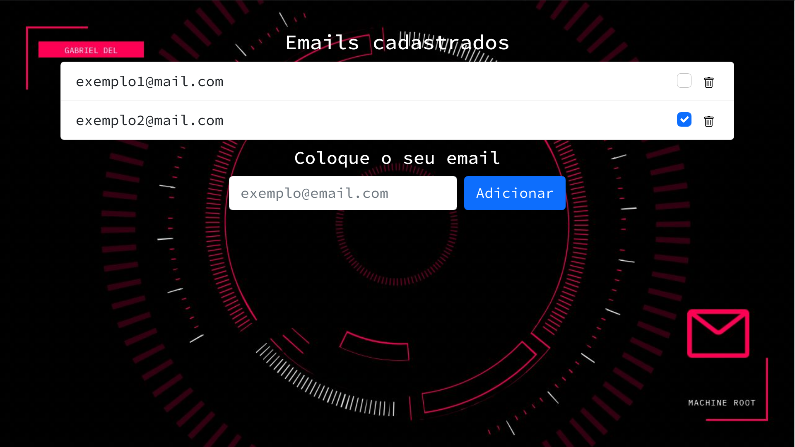

# CRUD Express Postgres

CRUD minimalista com banco de dados [PostgreSQL](https://www.postgresql.org/download/).

### Setup PostgreSQL

[Seguindo a Wiki do ArchLinux sobre o PostgreSQL](https://wiki.archlinux.org/title/PostgreSQL)
Instale-o, logue com `postgres` usando:
```bash
su -l postgres
```
Então crie um banco de dados chamado `postgres`.

E por fim, crie uma tabela `mails`

```SQL
CREATE TABLE mails (
  id SERIAL PRIMARY KEY,
  title VARCHAR(100) NOT NULL,
  checked  Boolean NOT NULL)
```

### Setup Projeto
Opós baixar o projeto, rode
```bash
npm install
```
para instalar as dependências.
E então:

```bash
npm run dev
```
para executá-lo.
O projeto estará acessível em: `http://localhost/4000`


# Demo



Deve-se colocar
```ejs
<%- include('../partials/emails.ejs') %>
```
na linha `7`de `src/views/pages/home.ejs`para ficar assim.


